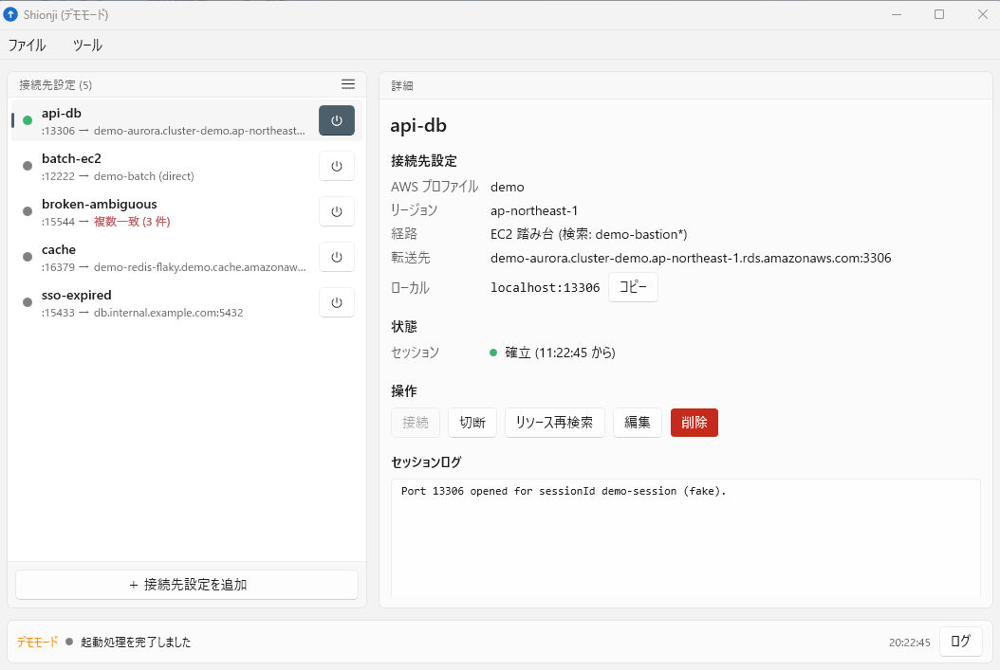

# Shionji

AWS Session Manager 専用のポートフォワード管理 GUI (Windows / WinUI 3)。

複数のポートフォワード設定を保持し、接続状況を一覧で可視化する。転送先はエンドポイント / IP の直接指定のほか、ElastiCache / Aurora / EC2 / ECS のリソースを検索条件から自動特定できる。トンネルは AWS SDK で `ssm:StartSession` を呼び、`session-manager-plugin.exe` を直接起動して確立する (AWS CLI 非依存)。

デモモードで、接続中の接続先設定を選択した状態のメインウィンドウを次の図に示す。

## 主な機能

備える機能を、以下にまとめる。

| 機能 | 内容 |
| --- | --- |
| 接続先設定の一覧と詳細 | 状態ドット、接続トグル、検索済みエンドポイントの要約を一覧に並べる。転送先を特定できていない設定は一覧と詳細で赤く示す |
| リソース自動検索 | 名前 glob とタグ条件で ElastiCache / Aurora / EC2 / ECS を特定する。保存前に条件を試せる |
| 踏み台の選択 | EC2 インスタンス (ID 指定 / 検索) と ECS タスク (ECS Exec) を経由できる。EC2 / ECS を転送先とする場合は直接セッションも張れる |
| 接続の維持 | 自動再接続、起動時自動接続、タスクトレイ常駐、切断時のトースト通知 |
| SSO の再ログイン | トークン切れを検知し、アプリ内のブラウザ承認でログインして自動的に再接続する |
| 監査に使えるログ | 画面には要約、ファイルには接続先・経由した踏み台・SSM セッション ID まで記録する |
| デモモード | `--demo` を付けて起動すると、AWS 無しで UI の全経路を確認できる |

## ドキュメント

### 利用者向け

- [インストール手順](docs/usage/setup.md)
- [設定](docs/usage/config.md)

### 開発者向け

- [ビルド](docs/development/build.md)
- [テスト](docs/development/test.md)
- [リリース](docs/development/release.md)

### 設計

- [構成概要](docs/architecture/overview.md)
- [ドメインモデル](docs/architecture/domain-model.md)

## リポジトリ構成

トップレベルのディレクトリと、そこに置くものを以下にまとめる。

| パス | 内容 |
| --- | --- |
| `src/Shionji.Domain` | 値オブジェクト、集約、ドメインサービス、状態機械、ポート定義 |
| `src/Shionji.Application` | セッション監督、解決キャッシュ、設定 CRUD、起動時処理 |
| `src/Shionji.Infrastructure` | AWS SDK アダプタ、plugin 起動、JSON 永続化、ログ、デモ用フェイク |
| `src/Shionji.Presentation` | GUI フレームワーク非依存の ViewModel |
| `src/Shionji.App.WinUI` | WinUI 3 ヘッド (unpackaged)。XAML と DI 構成のみ |
| `tests/` | 層ごとの単体テストと結合テスト、テスト補助 |
