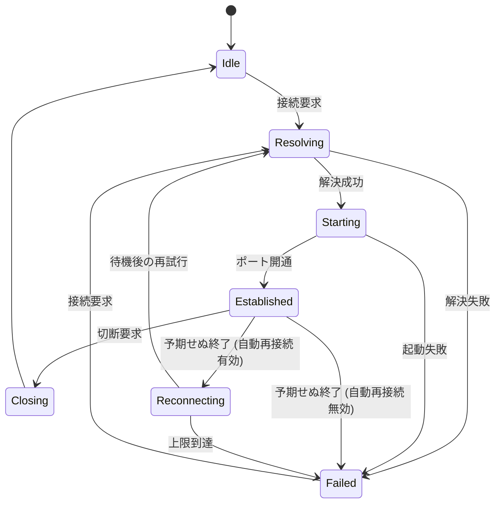

# ドメインモデル

本ドキュメントは、ドメイン層の型構造とそこに置いた規則を扱う。層の分け方と依存方向は、[構成概要](overview.md) を参照。

## ユビキタス言語

ドメイン層で用いる用語と、それに対応する型を以下にまとめる。

| 用語 | 型 | 意味 |
| --- | --- | --- |
| 転送設定 | `ForwardingConfig` | 名前付きのポートフォワード定義。集約ルートであり、永続化の単位 |
| 転送先 | `Destination` | 到達したい相手。直接指定またはリソースクエリ |
| リソースクエリ | `ResourceQuery` | AWS リソースの検索条件 |
| 経路 | `GatewaySpec` | SSM セッションを張る相手。直接接続を含む |
| 解決 | `ResolutionOutcome` | クエリを実リソースへ確定させた結果 |
| トンネル計画 | `TunnelPlan` | セッション起動に必要な情報がすべて具体化されたもの |
| トンネルセッション | `TunnelSession` | 接続のライフサイクル。実行時のみ存在し、永続化しない |

## 値オブジェクト

`Port`, `HostName`, `ConfigName`, `ProfileName`, `AwsRegion`, `InstanceId`, `ClusterName` などが該当する。

生成は静的ファクトリが担い、`Result<T, string>` を返す。制約を満たさない値のインスタンスは存在しない。

`NamePattern` は glob を正規表現へ変換して保持する。`*` は 0 文字以上、`?` は 1 文字に一致し、大文字と小文字を区別しない。

`TagFilter` はキーと値の組を持ち、値は完全一致で比較する。複数の `TagFilter` はすべてを満たすもの (AND) として扱う。

`LaunchCommand` は表示名とコマンド行を持つ。コマンド行が空の値は作れず、表示名が空の場合はコマンド行を表示名とする。コマンド行に含まれるプレースホルダの解釈は、実行する側が行う。

## 集約

`ForwardingConfig` は識別子、名前、AWS の文脈 (プロファイルとリージョン)、ローカルポートの指定、転送先、経路、オプション、コマンドの並びを持つ。

生成は `Create` が担い、次の不変条件を検証する。満たさない場合は `ConfigValidationError` を返し、インスタンスは作られない。

| 不変条件 | 内容 |
| --- | --- |
| `GatewayRequired` | エンドポイント直接指定、ElastiCache、Aurora のいずれかを転送先とする場合、経路に直接接続は選べない。これらは SSM セッションを張る相手にならないため。EC2 と ECS を転送先とする場合のみ直接接続を選べる |
| `PortRequired` | EC2 と ECS を転送先とする場合、転送先ポートの明示が必要。これらは既定ポートを持たないため。ElastiCache と Aurora はリソースから既定ポートを取得できる |

## 解決

`IResourceCatalog` がクエリを解決し、`ResolutionOutcome` を返す。取りうる結果は次のとおりである。

| 結果 | 意味 |
| --- | --- |
| `Resolved` | 1 件に特定できた |
| `NotFound` | 該当が無い |
| `Ambiguous` | 複数該当した。候補の一覧を持つ |
| `Failed` | 問い合わせ自体が失敗した。`ErrorDetail` を持つ |

`Ambiguous` を結果として持つのは、複数一致を失敗ではなく利用者への提示が要る状態として扱うため。クエリの `MatchPolicy` が先頭採用であれば、カタログ側で 1 件に絞って `Resolved` を返す。

`ErrorDetail` はフェーズ、コード、メッセージを持つ。フェーズは資格情報、権限、転送先の検索、経路の検索、セッション開始、plugin のいずれか。画面はフェーズに応じて提示を変え、資格情報の場合は SSO ログインの導線を出す。

## トンネル計画

`TunnelPlanner` は設定と解決済みリソースと確定したローカルポートから `TunnelPlan` を組み立てる純粋関数。AWS にも時刻にも触れない。転送先と経路の全組み合わせの導出がここに集約されている。

`TunnelPlan` は AWS の文脈、SSM ターゲット、セッションの方式、ローカルポートを持つ。

セッションの方式は 2 つある。方式ごとの転送の相手と SSM ドキュメントを、以下にまとめる。

| 方式 | 転送の相手 | SSM ドキュメント |
| --- | --- | --- |
| `DirectForward` | SSM セッションを張った相手自身のポート | `AWS-StartPortForwardingSession` |
| `RemoteHostForward` | SSM セッションを張った相手を経由した別ホストのポート | `AWS-StartPortForwardingSessionToRemoteHost` |

## 状態機械

`TunnelSession` が接続のライフサイクルを持つ。状態遷移はドメイン内で完結し、副作用を持たない。状態と遷移を図示すると、次の図のようになる。

`Established` はトンネル計画と確立時刻を持つ。`Reconnecting` は試行回数と次回までの待ち時間と原因を持つ。`Failed` は原因の `ErrorDetail` を持つ。

再接続の間隔と上限は `ReconnectPolicy` が決める。指数バックオフで 2 秒から 30 秒まで延び、5 回で打ち切る。

## ログ状態

`IDetailedLogState` は要約と詳細フィールドの一覧を持つ。出来事を記録する側はこの形で状態を渡し、画面向けには要約だけ、ファイル向けには詳細まで出力される。

出力先ごとの整形はインフラ層が行う。ドメイン層は何をどこへ出すかを知らない。
