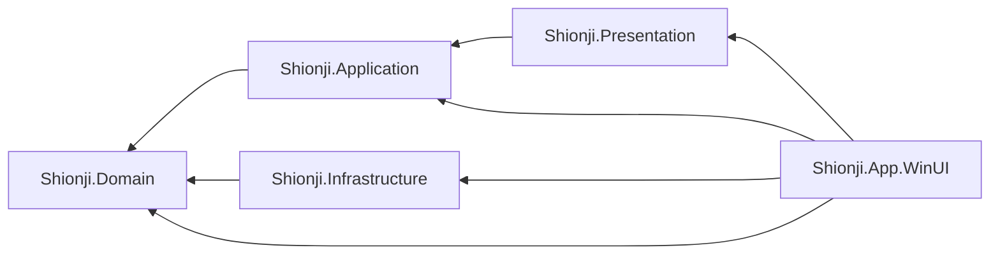
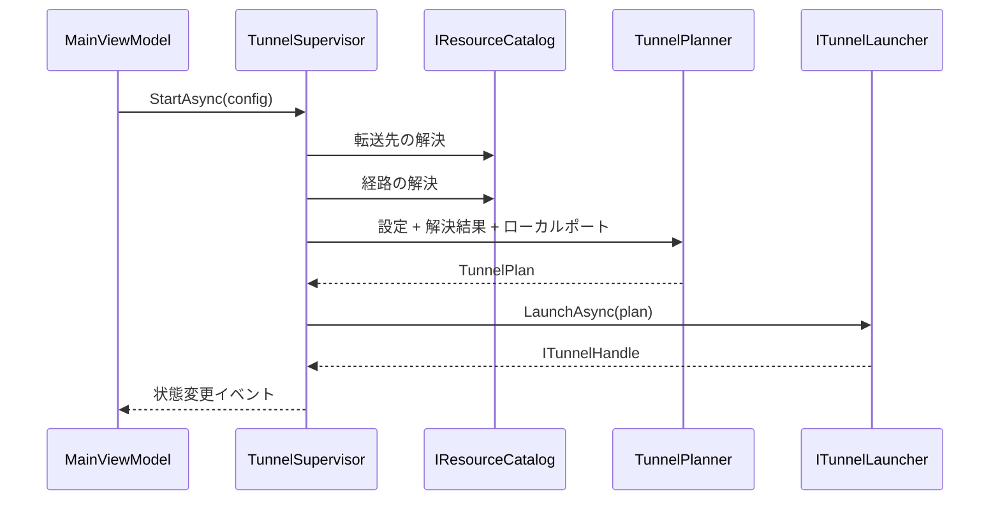

# 構成概要

ヘキサゴナル (ポートとアダプタ) 構成をとる。ドメイン層が外部との境界をインターフェースとして定義し、インフラ層がそれを実装する。GUI フレームワークへの依存を最上位の 1 プロジェクトに閉じ込め、乗り換えに耐える形にしている。

型の詳細は [ドメインモデル](domain-model.md) を参照。

## プロジェクトと依存方向

- インフラ層はアプリケーション層を参照しない。ドメイン層が定義したポートだけを見る
- WinUI ヘッドは全層を参照する。実装の選択と組み立てを行う唯一の場所であるため

## 各プロジェクトの責務

| プロジェクト | 責務 |
| --- | --- |
| `Shionji.Domain` | 純粋な C#。外部ライブラリを参照しない。値オブジェクト、集約、ドメインサービス、状態機械、ポートの定義 |
| `Shionji.Application` | ドメインのユースケースを束ねる。セッションの監督、リソース解決結果のキャッシュ、設定の CRUD、起動時処理。ポートの実装は持たない |
| `Shionji.Infrastructure` | ポートの実装。AWS SDK のアダプタ、`session-manager-plugin` のプロセス管理、JSON 永続化、ファイルログ、デモ用のフェイク |
| `Shionji.Presentation` | ViewModel。GUI フレームワークに依存せず、表示に必要な UI 側の能力を自分でインターフェースとして定義する |
| `Shionji.App.WinUI` | XAML、依存性注入の構成、タスクトレイ、トースト通知。ロジックを持たない |

## ポートとアダプタ

ドメイン層が定義するポートと、その実装の対応を示す。

| ポート | 役割 | 実装 | デモ用の実装 |
| --- | --- | --- | --- |
| `IResourceCatalog` | 検索条件から実リソースを特定する | `AwsResourceCatalog` | `FakeResourceCatalog` |
| `ITunnelLauncher` | トンネル計画から SSM セッションを起動する | `SessionManagerPluginLauncher` | `FakeTunnelLauncher` |
| `IForwardingConfigRepository` | 接続先設定の永続化 | `JsonForwardingConfigRepository` | `InMemoryConfigRepository` |
| `ILocalPortProbe` | ローカルポートの空き確認と待ち受け確認 | `TcpLocalPortProbe` | 同じものを使う |
| `ISsoLoginService` | ブラウザ承認による SSO ログイン | `SsoLoginService` | `FakeSsoLoginService` |
| `IClock` | 現在時刻 | `SystemClock` | 同じものを使う |

プレゼンテーション層が定義するポートは、すべて WinUI ヘッドが実装する。UI スレッドへの投げ込み、クリップボード、トースト通知、フォルダ選択、ウィンドウの表示、アプリ設定の読み書きとテーマの適用が該当する。

## 接続の流れ

- 解決は接続のたびに行う。事前にキャッシュした結果があっても、繋ぐ直前に取り直す
- `TunnelPlanner` は純粋関数で、AWS にも時刻にも触れない
- ハンドルの取得後、監督は終了イベントとログ行を購読する。トンネルはハンドルが渡る前から動いているため、購読前に起きた分は溜めて配り直される

## 横断的な方針

### 失敗の表現

例外ではなく `Result<TValue, TError>` で返す。ネットワークと外部プロセスに起因する失敗は想定内の分岐であり、呼び出し側に処理を強制するため。

失敗は `ErrorDetail` として、フェーズ (資格情報 / 権限 / 転送先の検索 / 経路の検索 / セッション開始 / plugin) とコードとメッセージを持つ。画面はフェーズを使って提示の仕方を変える。

### ログの振り分け

1 つの出来事につき要約と詳細フィールドを持ち、要約だけを画面へ、詳細まではファイルへ出す。要約と詳細の組はドメイン層の `IDetailedLogState` として表し、出力先ごとの整形はインフラ層のログプロバイダが行う。記録する側は出力先を知らない。

### 永続化の分離

ドメイン型を直接シリアライズせず、保存用の DTO を別に持って相互変換する。ドメインの表現を変えても保存形式を壊さないため。

### 子プロセスの後始末

`session-manager-plugin` は Windows の Job Object に入れて起動する。アプリが異常終了しても子プロセスが残らない。
